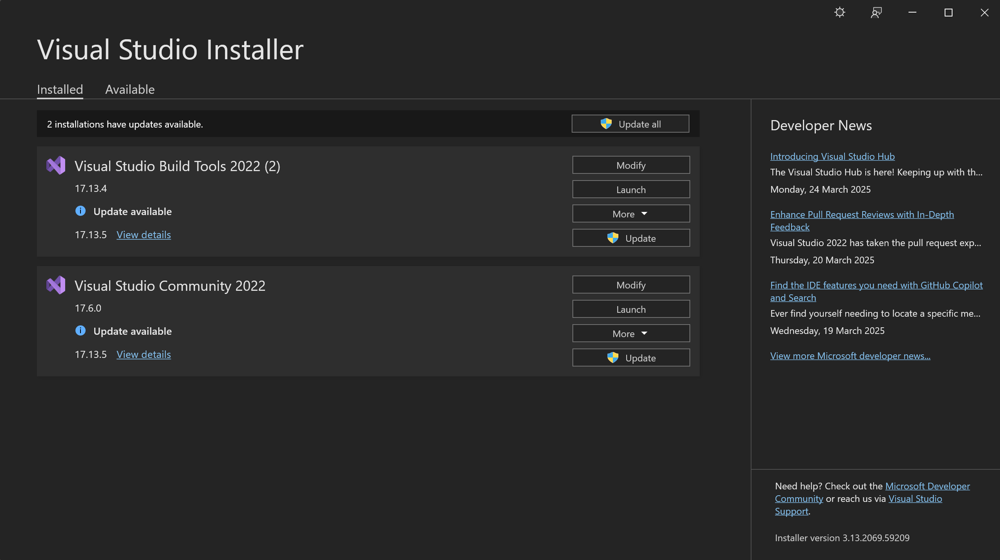

# T5G1
Group project for DSE3101 on question: Geopolitical distance and Global Trade


## Setup Instructions

### Prerequisites
Ensure you have `pyenv` installed. If not, you can install it by following the instructions [here](https://github.com/pyenv/pyenv#installation).

### Setting up the Virtual Environment

1. **Clone the repository:**
    ```sh
    git clone https://github.com/Saptow/T5G1.git
    cd T5G1
    ```

2. **Install Python 3.12.0 using pyenv:**
    ```sh
    pyenv install 3.12.0
    pyenv local 3.12.0
    ```

3. **Create a virtual environment:**
    ```sh
    python -m venv venv
    ```

4. **Activate the virtual environment: (DO THIS EVERYTIME YOU START THE PROJECT)**
    - On Windows:
        ```sh
        .\venv\Scripts\activate
        ```
    - On macOS/Linux:
        ```sh
        source venv/bin/activate
        ```

5. **Install the required packages:**
    ```sh
    pip install -r requirements.txt
    ```

Your virtual environment is now set up and you can start working on the project.


**IF YOU INSTALL NEW DEPENDENCIES/LIBRARIES**
run 
```sh
pip freeze > requirements.txt
```
(replace so that anyone after can just install using the requirements.txt to solve the problem)

### Running pytorch_geometric_temporal code
To do this, you might run into some issues installing the required packages. In that case, what you have to do is to install the packages manually. 

```sh
pip install torch_geometric

# Optional dependencies:
pip install pyg_lib torch_scatter torch_sparse torch_cluster torch_spline_conv -f https://data.pyg.org/whl/torch-2.6.0+cpu.html
```
## FOR WINDOWS
Also, before you install torch_geometric_temporal, need to install visual studio build tools. You can download it from [here](https://visualstudio.microsoft.com/visual-cpp-build-tools/).
There, you can refer to the screenshots attached within 


Under Visual Studio Build Tools 2022, click Modify, and install desktop development with C++ (based on screenshot)


Worst case scenario, I will build a docker image for this...

## Docker Image for deployment (backend)

To build the docker image, run the following command in the root directory of the project:

```sh
docker build -t t5g1-image .
```

To run the docker container, use the following command:

```sh
docker run -p 5000:5000 t5g1-image
```